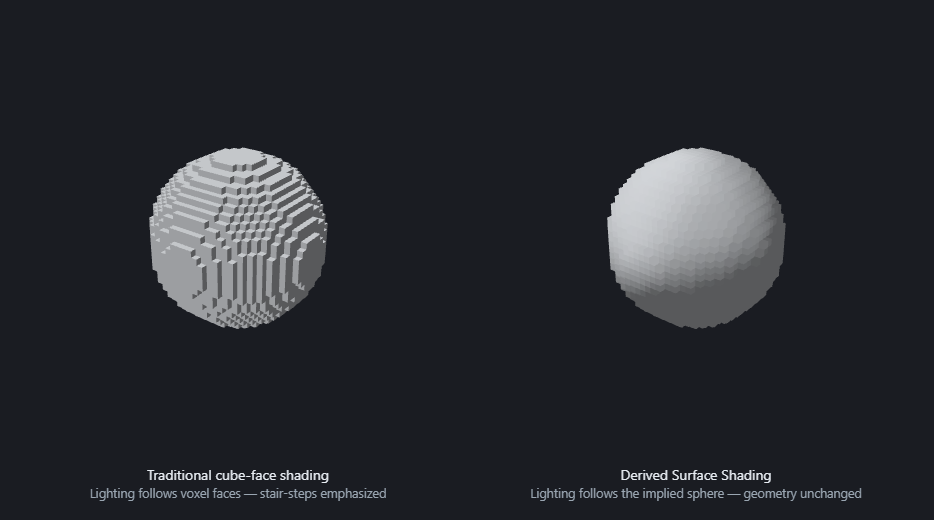

# Voxel Surface Normals

An exploration of **Derived Surface Shading (DSS)** - a family of techniques for lighting voxel
models by the *surface they imply* rather than by the cube faces they are made of.

This repository has two parts:

- **[`whitepaper/`](whitepaper/whitepaper.md)** - the motivation and theory. This is the heart of the
  project: it defines DSS, derives the normal-generation methods, and lays out the design space.
- **[`src/`](src/)** - a small WebGL voxel editor (a MagicaVoxel-inspired UX) built to implement
  those ideas and explore them interactively.

> The whitepaper is the *why*; the app is a hands-on way to see and feel the *what*.



*Identical voxel geometry, two shading approaches: traditional cube-face normals (left) make the lattice obvious, while derived surface normals (right) communicate the implied sphere. See the [whitepaper](whitepaper/whitepaper.md) for the full set of figures.*

---

## The idea in one paragraph

Traditional voxel renderers light each visible cube face using its geometric normal (`+X`, `-Y`,
…). This makes lighting describe the voxel *lattice* - emphasizing stair-stepping - instead of the
shape the voxels represent. A voxel model actually contains two representations at once: explicit
cube geometry, and an implicit surface defined by the occupancy field. DSS keeps the cube geometry
(and silhouette) exactly as-is, but derives surface normals from the occupancy field, so that
lighting communicates the larger-scale form. See the
[whitepaper](whitepaper/whitepaper.md) for the full treatment.

The problem splits into two independent axes:

1. **Normal-field generation** - how to extract surface orientation from occupancy.
   - *Density gradient* - the direction from solid space toward empty space (`N = ∇ρ`).
   - *Occupancy centroid* - the direction away from nearby occupied mass (`N = p − C`).
2. **Normal-field application** - how that orientation is used while shading.
   - *Cube faces* - classic per-face geometric normals (the baseline).
   - *Per-voxel* - one derived normal per voxel.
   - *Vertex-interpolated* - derived normals blended at cube corners for continuous, smooth-shaded
     lighting across faces.

Both DSS methods use an adjustable **kernel radius** (`1 → 3³`, up to `4 → 9³`): small kernels
preserve local detail, large kernels communicate global form.

## The editor

The app lets you build voxel models and toggle between shading approaches in real time so you can
directly compare the baseline against DSS.

Features:

- **Sculpt mode** - attach / erase / paint / pick tools, with voxel / box / line / face brushes,
  adjustable brush size, and X/Y/Z mirror symmetry.
- **Tri-view mode** - draw top / front / side silhouettes on planes; the model becomes their
  intersection.
- **DSS shading controls** - pick the normal field (gradient vs. centroid), the application mode
  (cube / per-voxel / vertex-interpolated), and the kernel radius live.
- **Derived ambient occlusion** - occupancy-based AO with per-voxel or vertex-interpolated modes,
  adjustable radius and intensity.
- **Starter shapes**, a customizable **palette**, and **.vox import** (MagicaVoxel files).
- Dynamic lighting (with optional auto-rotation), ground grid, voxel edges, undo/redo, and live
  voxel/face stats.

### Where the DSS implementation lives

- [`src/voxel/dss.ts`](src/voxel/dss.ts) - the core of the paper: gradient and centroid normal
  fields, the kernel/Gaussian weighting, the normal cache, and vertex-interpolated normals.
- [`src/voxel/ao.ts`](src/voxel/ao.ts) - occupancy-derived ambient occlusion.
- [`src/voxel/meshBuilder.ts`](src/voxel/meshBuilder.ts) - builds the cube mesh and applies the
  chosen normals/AO.
- [`src/engine/`](src/engine/) - the Three.js engine, viewport interaction, and tri-view planes.

## Getting started

Requires [Node.js](https://nodejs.org/) (18+).

```bash
npm install
npm run dev      # start the dev server (Vite)
```

Then open the printed local URL in a browser.

Other scripts:

```bash
npm run build     # type-check and build for production
npm run preview   # preview the production build
npm run typecheck # type-check only
npm run lint      # run ESLint
```

### Regenerating the whitepaper figures

The whitepaper figures are produced from the project's own code so they stay
faithful to the implementation:

- **3D render figures** are drawn by a small harness in [`figures/`](figures/)
  that reuses the real `buildVoxelMesh` / DSS code. With the dev server running,
  open `http://localhost:<port>/figures/?fig=N` (N = 1, 7, 8, 9, 12, 13) and
  screenshot the figure. Figure 13 loads the real `.vox` assets from
  [`src/examples/`](src/examples/).
- **Conceptual diagrams** (the SVG cross-sections) are generated by
  [`figures/gen-diagrams.mjs`](figures/gen-diagrams.mjs):

```bash
node figures/gen-diagrams.mjs   # writes whitepaper/figures/figure-{2,5,6,11}.svg
```

- **The dynamic-lighting animation** (`lighting-phasing.gif`) is recorded by a
  small capture server that renders the orbiting split-view and encodes the
  frames to a GIF with a pure-JS encoder (no ffmpeg needed):

```bash
node figures/record-gif.mjs     # then open http://localhost:7788/ once
```

## Tech stack

- [React](https://react.dev/) + [TypeScript](https://www.typescriptlang.org/)
- [Three.js](https://threejs.org/) for WebGL rendering
- [Zustand](https://github.com/pmndrs/zustand) for editor state
- [Vite](https://vite.dev/) for tooling

## Status

This is a research prototype. The whitepaper outlines several open directions - larger kernels,
alternative weighting functions, GPU normal generation, and DSS combined with palette-quantized
lighting - that remain to be explored.

## License

The **DSS method library** is released under the [MIT License](src/voxel/LICENSE). This covers the
core algorithm and data files in [`src/voxel/`](src/voxel/):

- [`dss.ts`](src/voxel/dss.ts) - gradient & centroid normal fields, kernel weighting, normal cache,
  and vertex-interpolated normals
- [`ao.ts`](src/voxel/ao.ts) - occupancy-derived ambient occlusion
- [`meshBuilder.ts`](src/voxel/meshBuilder.ts) - cube mesh construction with derived normals/AO applied
- [`VoxelData.ts`](src/voxel/VoxelData.ts) - sparse voxel volume / occupancy field
- [`palette.ts`](src/voxel/palette.ts) - color palette model used by the above

Each of these files carries an `SPDX-License-Identifier: MIT` header.

**The editor application is intentionally excluded.** Everything else in the repository - the React
UI ([`src/components/`](src/components/), [`src/state/`](src/state/)), the Three.js engine
([`src/engine/`](src/engine/)), the editor-support helpers in `src/voxel/` (`voxParser.ts`,
`starterShapes.ts`, `TriViewMasks.ts`), the figure harness, and the whitepaper - is **not** covered
by the MIT license unless a file carries its own MIT SPDX header. The method library is self-contained
(it has no dependencies back into the editor), so it can be reused independently of this app.

## Credits

The example voxel models in [`src/examples/`](src/examples/) - used for several whitepaper figures
and bundled with the editor - were contributed by [Zach Soares (@Voxels)](https://x.com/Voxels).
Thanks!
