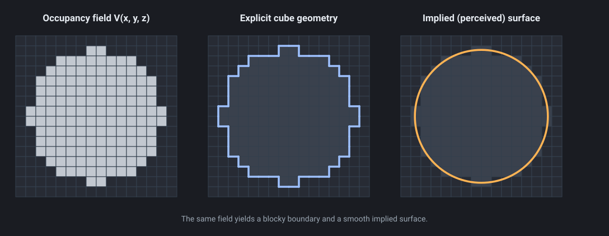
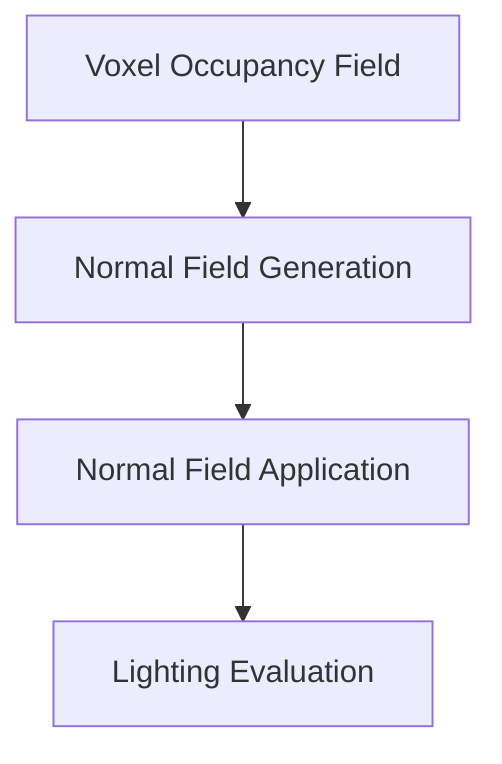
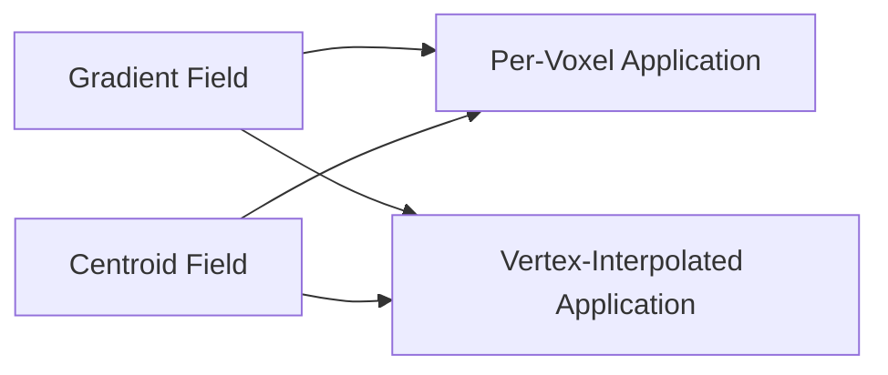
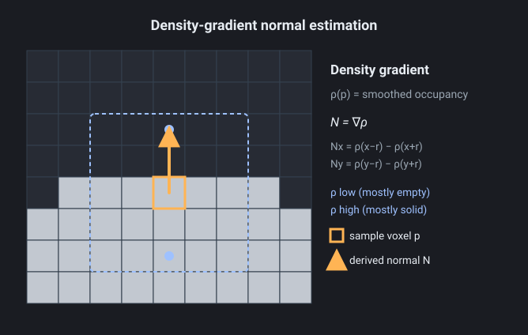
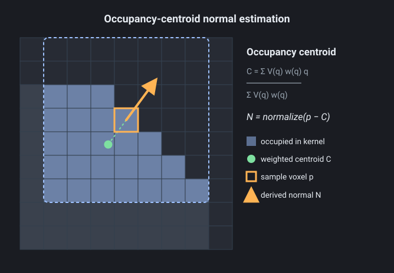
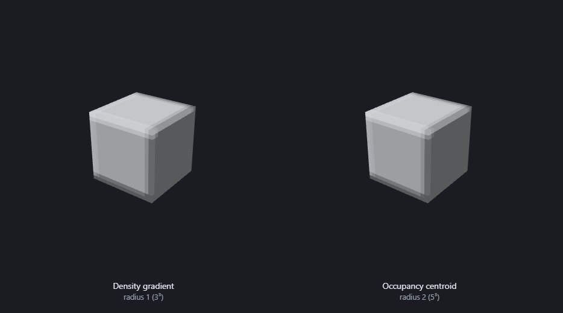
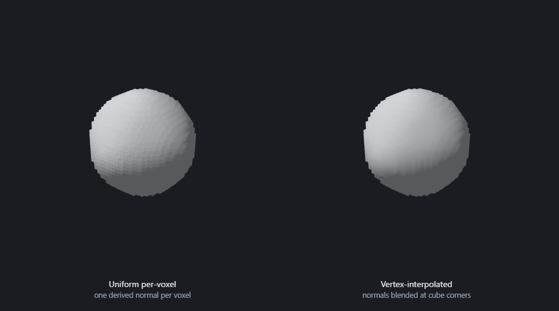
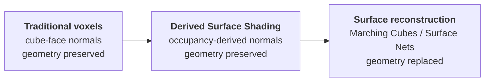
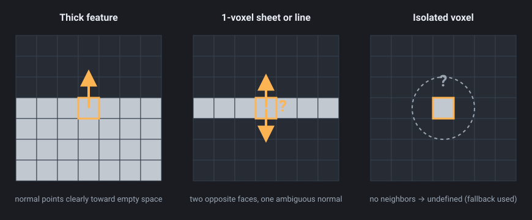
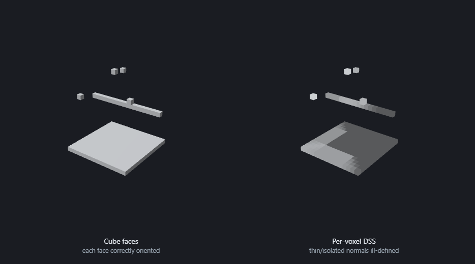

# Derived Surface Shading for Voxel Fields


*One voxel asset, three shading approaches over identical geometry: traditional cube faces (left), per-voxel Derived Surface Shading (center), and vertex-interpolated DSS (right). The occupancy-centroid normal field (radius 1) lets lighting describe the implied form while the blocky silhouette is preserved. Model by [Zach Soares (@Voxels)](https://x.com/Voxels).*

## Abstract

Traditional voxel rendering illuminates visible cube faces using the geometric normals of the underlying voxel geometry. While this approach reinforces the block-based aesthetic of voxel graphics, it causes lighting to describe the voxel lattice rather than the shape represented by the voxel field.

This paper explores a family of techniques collectively referred to as **Derived Surface Shading (DSS)**. DSS preserves voxel geometry and silhouettes while deriving lighting information from the occupancy field itself. Rather than treating each visible cube face as an independent lighting primitive, DSS attempts to estimate the orientation of the surface implied by neighboring voxels.

The central observation is that a voxel model contains two distinct representations simultaneously:

1. Explicit cube geometry.
2. An implicit surface represented by voxel occupancy.

Traditional voxel rendering shades the former. DSS shades the latter.

Two approaches to surface normal derivation are examined - density-gradient fields and occupancy-centroid fields - and organized into a framework that separates the problem into two orthogonal stages:

1. Surface normal derivation from occupancy.
2. Surface normal application during shading (a single normal per voxel by default, or normals interpolated across cube vertices).

This decomposition creates a broad design space that preserves voxel geometry while allowing illumination to communicate larger-scale shape information.

---

# 1. Introduction

Voxel rendering occupies an unusual position within computer graphics.

Unlike polygonal rendering, where geometry explicitly defines a surface, voxel models are volumetric. Yet most voxel renderers ultimately convert this volume into visible cube faces and illuminate those faces using conventional geometric normals.

For a visible voxel:

```text
Top    -> ( 0, 1, 0)
Bottom -> ( 0,-1, 0)
Left   -> (-1, 0, 0)
Right  -> ( 1, 0, 0)
Front  -> ( 0, 0, 1)
Back   -> ( 0, 0,-1)
```

This approach is computationally efficient and visually recognizable. It is also deeply tied to the visual identity of voxel graphics.

However, it produces an important artifact:

> Lighting describes the voxel lattice rather than the represented shape.

Consider a voxelized sphere.

The occupancy field clearly represents a sphere. Yet traditional lighting causes illumination to follow the orientation of individual cube faces, emphasizing stair-stepping artifacts and obscuring larger-scale form.

This effect becomes increasingly apparent as voxel resolution increases. At sufficiently high resolutions, viewers often perceive the object as a sampled surface rather than a collection of intentionally visible cubes.

This paper investigates an alternative approach:

> Can voxel geometry remain unchanged while lighting communicates the surface implied by the occupancy field?

---

## Figure 1. Traditional Voxel Shading vs Derived Surface Shading


Two identical voxelized spheres. **Left:** traditional cube-face shading - lighting follows the voxel faces, emphasizing stair-step artifacts. **Right:** occupancy-derived shading (a single derived normal per voxel) - lighting follows the implied spherical form. Note that the geometry and silhouette are unchanged; only the source of normals differs.

---

# 2. Geometry and Representation

The key insight behind DSS is that a voxel model contains two simultaneous representations.

## Explicit Representation

The explicit representation consists of visible cube geometry.

This is the geometry submitted to the renderer.

```text
Voxel Field
    ↓
Visible Cube Faces
    ↓
Rasterization
```

This representation defines:

- Silhouette
- Topology
- Visible geometry

---

## Implicit Representation

The implicit representation consists of the occupancy field itself.

Humans often interpret this field as an approximation of a continuous surface.

A voxelized sphere is still perceived as a sphere.

A voxelized character is still perceived as a character.

A voxelized terrain hill is still perceived as a hill.

This implicit representation is not explicitly stored as geometry, yet it strongly influences perception.

DSS attempts to derive lighting information from this representation.

---

## Figure 2. Explicit Geometry vs Implicit Surface



A 2D cross-section of the same occupancy field. **Left:** the raw occupancy field $V$. **Center:** the explicit cube geometry submitted to the renderer - a stair-stepped boundary. **Right:** the smooth surface a viewer perceives. Traditional shading describes the center; DSS aims to describe the right.

---

# 3. Derived Surface Shading

Derived Surface Shading is defined as:

> Any shading method that derives surface orientation from voxel occupancy rather than cube geometry.

Traditional voxel shading:

```text
Voxel Field
    ↓
Cube Geometry
    ↓
Cube Face Normal
    ↓
Lighting
```

Derived Surface Shading:

```text
Voxel Field
    ↓
Derived Surface Normal Field
    ↓
Lighting
```

The renderer continues to draw cubes.

Only the source of normal information changes.

---

## Behavior Under Dynamic Lighting

The difference between the two normal sources becomes especially pronounced when the light moves. Because traditional shading draws every normal from one of only six cube-face directions, a moving light makes large groups of faces brighten and darken in lockstep, then snap to the next state as the light crosses a face boundary. The surface appears to *phase* between six discrete lighting orientations - a faceted popping that constantly redraws attention to the lattice.

A derived normal field has no such quantization. Each voxel (or vertex) carries a continuous orientation, so as the light orbits, shading sweeps smoothly across the implied surface with no banding or popping. This is one of the clearest practical advantages of DSS, and it is most apparent in motion.


*An orbiting light over identical voxel geometry. **Left** (cube-face normals): shading snaps between the six face directions, producing visible phasing as the light moves. **Right** (per-voxel derived normals): shading varies continuously, with no phasing. The effect is strongest in motion - view the animation to see it sweep.*

---

# 4. System Architecture

During experimentation, it became apparent that DSS naturally decomposes into two independent problems.

1. How should surface orientation be extracted from occupancy?
2. How should that orientation be applied during lighting?

This distinction proved more useful than reasoning about individual algorithms.



**Figure 3.** High-level DSS architecture.

---

## 4.1 Normal Field Generation

Generate a field of surface normals from occupancy.

Possible methods:

- Density Gradient
- Occupancy Centroid
- Future techniques

---

## 4.2 Normal Field Application

Apply the generated normal field during lighting.

Possible methods:

- Uniform Per Voxel
- Vertex Interpolated

---

The resulting design space is:



**Figure 4.** Normal generation and normal application are independent axes.

---

# 5. Occupancy Fields

Let

$$V(x,y,z) \in \{0,1\}$$

represent voxel occupancy, where $1$ is occupied and $0$ is empty.

The occupancy field therefore defines a discrete volume.

The purpose of DSS is to estimate the orientation of the surface implied by this volume.

---

# 6. Density Gradient Fields

## 6.1 Motivation

A surface normal may be interpreted as the direction of greatest change between solid and empty space.

This suggests treating occupancy as a density field.

The desired normal becomes

$$N = \nabla \rho$$

where $\rho(x,y,z)$ is a smoothed occupancy density.

---

## 6.2 Density Estimation

Occupancy is first blurred using a weighted kernel.

For a sample position $p = (x,y,z)$, density is estimated as

$$\rho(p) = \frac{\sum_{q} V(q)\,w(q)}{\sum_{q} w(q)}$$

where $q \in \mathcal{N}(p)$ ranges over the neighborhood kernel and $w(q)$ is a weighting function.

This step is a **convolution**: the occupancy field is filtered by the kernel $w$. With a Gaussian $w$ (and the normalizing $\sum_{q} w(q)$ denominator), it is precisely a normalized Gaussian blur of occupancy.

The prototype implementation uses Gaussian weighting

$$w = \exp\!\left(-\frac{d^2}{2\sigma^2}\right), \qquad d = \lVert q - p \rVert$$

---

## 6.3 Gradient Estimation

The density gradient is estimated using finite differences:

$$
\begin{aligned}
N_x &= \rho(x-r,\,y,\,z) - \rho(x+r,\,y,\,z) \\
N_y &= \rho(x,\,y-r,\,z) - \rho(x,\,y+r,\,z) \\
N_z &= \rho(x,\,y,\,z-r) - \rho(x,\,y,\,z+r)
\end{aligned}
$$

The resulting vector is normalized:

$$N = \mathrm{normalize}(N_x, N_y, N_z)$$

Smoothing followed by a finite-difference gradient is itself a single linear operation: convolving occupancy with a **derivative-of-Gaussian** kernel. The density-gradient field is therefore a standard **convolution filter** - the same family of operators used for gradient and edge detection in image and volume processing. (The prototype zeroes the kernel's weight along the axis being differenced, making the filter slightly anisotropic, but the operation remains a kernel convolution.)

---

## 6.4 Interpretation

Density-gradient normals answer:

> Which direction leads from solid space toward empty space?

This interpretation is closely related to surface normal generation in:

- Volume rendering
- Signed Distance Fields
- Marching Cubes
- Surface Nets

Unlike those systems, DSS does not reconstruct geometry.

---

## Figure 5. Density Gradient Normal Estimation



The smoothed occupancy density $\rho$ is sampled at $\pm r$ offsets on each axis. The per-axis finite differences (e.g. $N_x = \rho(x-r) - \rho(x+r)$) form a vector pointing from solid space toward empty space - the derived surface normal $N = \nabla\rho$.

---

# 7. Occupancy Centroid Fields

## 7.1 Motivation

An alternative interpretation is based on mass distribution.

Instead of detecting surface transitions, the renderer asks:

> Where is nearby occupied space concentrated?

---

## 7.2 Centroid Computation

For a voxel position $p$, the weighted occupancy centroid is

$$C = \frac{\sum_{q} V(q)\,w(q)\,q}{\sum_{q} V(q)\,w(q)}$$

where $q$ ranges over the neighborhood kernel.

---

## 7.3 Normal Derivation

The normal points away from the centroid:

$$N = \mathrm{normalize}(p - C)$$

Both the numerator $\sum_{q} V(q)\,w(q)\,q$ and the denominator $\sum_{q} V(q)\,w(q)$ are convolutions of the occupancy field with kernels (the first weighted by position, the second by $w$ alone). Because the result is their ratio - dividing by the locally varying occupied mass - the centroid field is a **normalized convolution** rather than a single linear filter: convolution-based, but nonlinear due to the per-voxel normalization.

---

## 7.4 Interpretation

Centroid normals estimate the direction away from nearby occupied mass.

This creates a more sculptural interpretation of the occupancy field.

Large kernels increasingly emphasize overall form rather than local topology.

---

## Figure 6. Occupancy Centroid Normal Estimation



Within the kernel around $p$, the Gaussian-weighted centroid $C$ of the occupied voxels is computed. The normal $N = \mathrm{normalize}(p - C)$ points away from the nearby occupied mass - a mass-distribution interpretation of surface orientation.

---

# 8. Kernel Radius

Both explored approaches rely on a neighborhood kernel.

Let $r$ represent the kernel radius.

| Radius | Kernel Size |
| ------ | ----------- |
| 1      | 3×3×3       |
| 2      | 5×5×5       |
| 3      | 7×7×7       |
| 4      | 9×9×9       |

Increasing radius causes normals to become increasingly influenced by larger-scale structures.

Small kernels:

- Preserve local detail.
- React strongly to stair-stepping.

Large kernels:

- Produce smoother fields.
- Better communicate global form.

---

## Figure 7. Kernel Radius Comparison


A cube with a small stub protruding from each face, shaded per-voxel with each normal field (top: gradient, bottom: centroid) across kernel radii 1–4. Small kernels (left) preserve the sharp corners and stubs; larger kernels (right) round the corners and absorb the stubs, communicating progressively larger-scale form.

---

# 9. Experimental Observation

A notable result emerged during testing.

For many shapes,

$$\text{Centroid}(r = n) \approx \text{Gradient}(r = n-1)$$

visually.

Although the algorithms are conceptually different, both tend to align with the dominant direction toward empty space.

This suggests that density-gradient methods may produce comparable results using smaller kernels.

The observation remains qualitative and warrants future quantitative analysis.

---

## Figure 8. Gradient vs Centroid Similarity



Density gradient at radius 1 (left) versus occupancy centroid at radius 2 (right). Although the algorithms are conceptually different, this equivalent pair is visually indistinguishable - the convergence noted in Section 9, where $\text{Centroid}(r) \approx \text{Gradient}(r-1)$ (here, occupancy $r = 2$ ≈ density $r = 1$). The two fields only differ meaningfully at the smallest radii; by larger radii the difference vanishes entirely.

---

# 10. Normal Field Application

The normal field and its application are independent concerns.

The same normal field can be shaded in multiple ways.

---

## 10.1 Uniform Per-Voxel Application

A single derived normal is assigned to an entire voxel.

All visible faces share the same lighting result.

```text
Voxel
    ↓
Derived Normal
    ↓
Single Lighting Evaluation
```

This preserves a strongly voxelized appearance.

---

## 10.2 Vertex-Interpolated Application

Instead of assigning a single normal to an entire voxel, normals are treated as samples of a continuous field.

For each cube vertex:

1. Gather neighboring voxel normals.
2. Blend them.
3. Normalize the result.

The resulting vertex normal is supplied to the rasterizer.

Lighting then varies continuously across voxel faces.

Geometry remains unchanged.

Only the normal field becomes continuous.

This can be interpreted as the voxel analogue of smooth-shaded polygon rendering.

---

## Figure 9. Per-Voxel vs Vertex-Interpolated Application



The same normal field (gradient, radius 2), applied two ways. **Left:** a uniform normal per voxel, giving a faceted result. **Right:** normals blended at cube corners, giving continuous shading across faces. Application strategy is independent of normal generation.

---

# 11. Prototype Implementation

A WebGL prototype was implemented to evaluate the proposed techniques.

Features include:

- Density-gradient normal fields
- Occupancy-centroid normal fields
- Adjustable kernel radii
- Dynamic lighting
- Per-voxel shading
- Vertex-interpolated shading
- Normal field visualization

The prototype computes normals only for visible voxels.

A normal cache is maintained to avoid repeated normal computation during interpolation.

For vertex-interpolated shading:

1. Compute a base normal field.
2. Gather neighboring normals at each cube corner.
3. Blend and normalize.
4. Submit resulting vertex normals to the rasterizer.

This preserves explicit voxel geometry while allowing illumination to vary continuously across cube faces.

---

# 12. Computational Complexity

Let $r$ represent the kernel radius.

---

## Occupancy Centroid

Single neighborhood traversal:

$$O\!\left((2r+1)^3\right)$$

---

## Density Gradient

Naive implementation:

$$6 \times O\!\left((2r+1)^3\right)$$

because density must be evaluated at multiple offset locations.

Optimized implementations may reduce this cost through:

- Cached density fields
- Separable convolutions
- Derivative-of-Gaussian kernels
- GPU compute pipelines

The practical cost therefore depends heavily on implementation strategy.

---

# 13. Relationship to Existing Techniques

DSS differs fundamentally from:

- Marching Cubes
- Surface Nets
- Dual Contouring

Those techniques reconstruct geometry.

DSS does not.

Instead DSS leaves voxel geometry untouched and modifies only the source of normal information.

The closest conceptual relatives are:

- Volume rendering gradients
- SDF normal generation
- Smooth-shaded polygon rendering

DSS can be viewed as applying those ideas directly to voxel occupancy while preserving explicit cube geometry.

---

## Figure 10. Position of DSS Within Voxel Rendering



**Figure 10.** DSS sits between traditional voxel shading and full surface reconstruction: it borrows occupancy-derived orientation from reconstruction techniques while preserving explicit cube geometry like traditional rendering.

---

# 14. Known Artifacts: Thin and Isolated Features

Because DSS derives a normal from the *neighborhood* of a voxel, it relies on there being enough surrounding occupancy to imply an orientation. Features that are only one voxel thick - or isolated entirely - do not provide that context, and their derived normals become ill-defined.



Three failure modes (2D cross-sections). **Left:** a thick feature resolves a clear outward normal. **Center:** a one-voxel-thick sheet (or line) has two opposite faces, but its symmetric neighborhood yields a single, sign-ambiguous normal - the centroid coincides with the voxel and the gradient vanishes. **Right:** an isolated voxel has no neighborhood mass at all, so no orientation can be derived and the prototype falls back to the direction away from the volume center.

Concretely, for a one-voxel-thick plate both the centroid offset $p - C$ and the density gradient $\nabla\rho$ are (near) zero along the degenerate axis, so the two faces that should carry opposite normals instead receive the same one. The effect is plainly visible when such features are shaded per-voxel:



A scene of thin and isolated features. **Left:** classic cube-face shading, where every face is correctly oriented. **Right:** per-voxel DSS, where the plate's normals collapse to the radial fallback (note the abrupt brightness patches), the line bands, and the isolated voxels are lit from an arbitrary direction.

In practice the severity depends heavily on the asset. On organic, detailed models the ill-defined normals on single-voxel detail often read as acceptable high-frequency variation rather than obvious error:


Two real-world `.vox` assets, each shown with a traditional cube-face control (left) and per-voxel DSS (right), using each file's own palette. Against the control, the DSS versions give the solid stone and timber a rounded, form-revealing read instead of flat per-face lighting. The second asset adds single-voxel foliage, which exhibits exactly the ill-defined-normal behavior described above - yet because it is scattered greenery, the resulting variation reads as natural leafy noise rather than a defect. Models by [Zach Soares (@Voxels)](https://x.com/Voxels).

A natural mitigation (Section 15) is to detect thin or isolated voxels and fall back to cube-face normals there, so DSS is applied only where the occupancy field actually implies a surface.

---

# 15. Future Work

Several directions remain unexplored.

## Thin-Feature Handling

Detect one-voxel-thick and isolated features (e.g. by the magnitude of the derived normal before normalization, or by neighbor count) and revert them to cube-face normals, blending back into DSS as local thickness increases. This would remove the artifacts of Section 14 while leaving thicker regions untouched.

A complementary approach, suggested by [@LongTimeNoDuck](https://x.com/LongTimeNoDuck/status/2062932216334762202), is to resolve the ambiguity at the *face* level rather than discarding DSS where it is weak: set the normals **per face**, but still vary them smoothly across each face. Because every exposed face keeps its own normal, the derived direction can be signed by that face's geometric orientation - flipping it into the same hemisphere as the cube-face normal (e.g. negating when $N \cdot N_\text{face} < 0$). On a one-voxel-thick sheet this lets the two opposing faces carry the same magnitude of derived detail while pointing in opposite, correct directions - recovering the front/back distinction that a single per-voxel normal cannot express, while keeping the voxel geometry clearly legible. Where the derived normal degenerates entirely, the face normal remains as the natural limit, so the method spans the range from full DSS on thick regions to cube-face shading on thin ones. He [demonstrated this](https://x.com/LongTimeNoDuck/status/2062932216334762202) on a voxelized Blender *Suzanne*, where the form reads as rounded while every cube face stays visible.

## Reconstructed-Hull Normals

A different alternative to deriving normals from the occupancy field directly is to borrow them from a reconstructed surface. An isosurface could be extracted from the same occupancy - via Marching Cubes, Surface Nets, or Dual Contouring - its smooth per-vertex normals computed, and those normals projected back onto the voxels (or their exposed faces) to drive shading. The cube geometry would still be rendered unchanged (Section 13); only the source of normal information would differ, keeping the blocky voxel silhouette while lighting it from a smooth implied hull.

The extracted hull does represent the front and back of a one-voxel-thick sheet as two distinct surfaces with opposing orientations, but this only helps the thin-feature case of Section 14 if the normals are applied *per face*. Collapsing them to a single normal per voxel - the per-voxel principle of DSS - runs into the same wall: one normal still cannot point in two opposite directions at once. So the reconstructed hull supplies better source normals, but resolving the sign ambiguity requires the same shift to per-face application discussed under thin-feature handling above; per-voxel, it remains unresolved. The trade-offs are a full reconstruction pass and the need to resolve the voxel-to-surface correspondence (e.g. nearest-surface sampling or rasterizing hull normals into the volume) - heavier than the local convolutions used here, and dependent on the reconstruction's own parameters.

## Alternative Weighting Functions

Potential alternatives include:

- Inverse distance weighting
- Exponential falloff
- Box filters
- Curvature-aware weighting

---

## GPU Implementation

Investigate:

- Compute-shader normal generation
- Sparse voxel acceleration
- Incremental updates for editable voxel worlds

---

## Quantized Lighting

An especially promising direction combines DSS with palette-quantized lighting.

```text
Derived Surface Normal
        +
Quantized Lighting Bands
        +
Voxel Geometry
```

This may better communicate form while preserving the aesthetic language of pixel art.

---

# 16. Conclusion

Voxel models contain two simultaneous representations:

1. Explicit cube geometry.
2. An implicit surface represented by occupancy.

Traditional voxel rendering shades the former.

Derived Surface Shading shades the latter.

The central contribution of this work is not a specific normal-generation algorithm, but a framework for separating voxel geometry from voxel illumination.

Within this framework, surface orientation becomes a derived property of occupancy rather than a consequence of cube geometry.

This allows voxel renderers to preserve silhouettes, topology, and geometric identity while communicating larger-scale shape information through lighting.

The resulting design space remains largely unexplored and offers numerous opportunities for future research in voxel rendering, stylized graphics, and occupancy-based surface representation.

---

# Acknowledgments

The example voxel models used in several figures (the well assets) were contributed by [Zach Soares (@Voxels)](https://x.com/Voxels). The per-face smooth-normal direction discussed in Section 15 was suggested by [@LongTimeNoDuck](https://x.com/LongTimeNoDuck/status/2062932216334762202).
